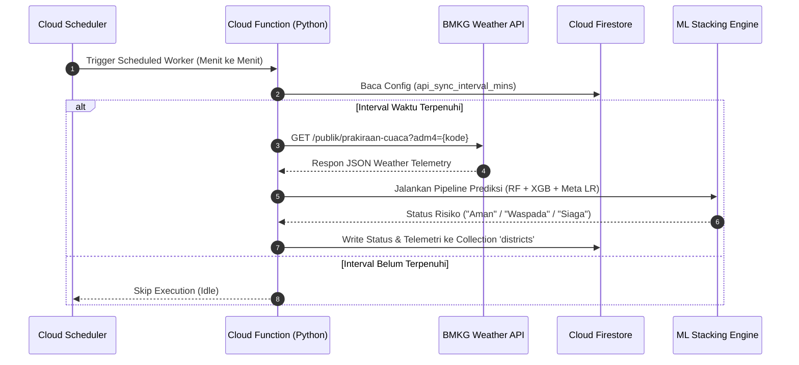
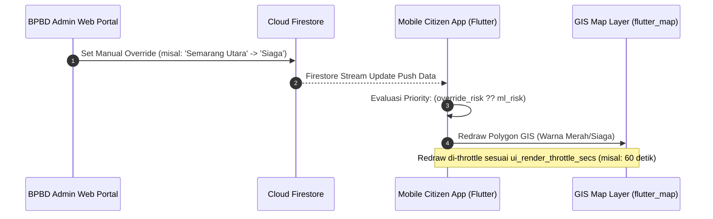

# Product Requirement Document (PRD): Integrasi API, Flow Fitur & Kode Wilayah SIPANDA

**Dokumen ID**: PRD-API-SIPANDA-2026  
**Tanggal Update**: 27 Juli 2026  
**Proyek**: SiPanda (Sistem Integrasi Peringatan Dini Adaptif - Semarang)  
**Status**: Dokumentasi Spesifikasi API & Alur Sistem  

---

## 1. Ringkasan Eksekutif & Deskripsi Produk

**SIPANDA** (Sistem Integrasi Peringatan Dini Adaptif) adalah sistem peringatan dini banjir berbasis *cloud-serverless* dan *Machine Learning Stacking Ensemble* (Random Forest, XGBoost, dan Logistic Regression) untuk wilayah Kota Semarang. 

Sistem ini mengambil data meteorologi secara otomatis dari API pihak ketiga (BMKG & OpenStreetMap), memproses prediksi risiko banjir di tingkat kecamatan, dan menyediakannya secara *real-time* kepada aplikasi mobile warga serta web portal admin BPBD/Kominfo.

---

## 2. Dokumentasi Endpoint API

SiPanda mengintegrasikan beberapa layanan API eksternal dan internal backend Firebase:

### 2.1. API Spatial GeoJSON (OpenStreetMap Nominatim)
Digunakan untuk mengunduh koordinat *polygon* GeoJSON wilayah kecamatan di Semarang untuk visualisasi GIS pada aplikasi Flutter.

* **Endpoint**:
  ```http
  GET https://nominatim.openstreetmap.org/search.php?q={Kecamatan}+Kota+Semarang&polygon_geojson=1&format=jsonv2
  ```
* **Method**: `GET`
* **Header Required**: `User-Agent: SiPanda/1.0`
* **Parameter Query**:
  * `q` *(string)*: Nama Kecamatan + "Kota Semarang" (misal: `Semarang+Utara+Kota+Semarang`)
  * `polygon_geojson` *(integer)*: `1` (mengembalikan objek koordinat GeoJSON)
  * `format` *(string)*: `jsonv2`

---

### 2.2. API Prakiraan Cuaca BMKG (Public API)
Digunakan oleh *Cloud Functions Backend* untuk mengambil data prakiraan cuaca, curah hujan (`tp`), kelembapan (`hu`), dan suhu (`t`) secara berkala.

* **Endpoint**:
  ```http
  GET https://api.bmkg.go.id/publik/prakiraan-cuaca?adm4={kode_adm4}
  ```
* **Method**: `GET`
* **Parameter Query**:
  * `adm4` *(string)*: Kode administrasi wilayah tingkat kelurahan/kecamatan (format: `33.74.xx.1001`).
* **Contoh URL**:
  `https://api.bmkg.go.id/publik/prakiraan-cuaca?adm4=33.74.01.1001`
* **Format Response Penting**:
  ```json
  {
    "data": [
      {
        "cuaca": [
          [
            {
              "local_datetime": "2026-07-27 12:00:00",
              "t": 30.0,
              "hu": 75.0,
              "tp": 12.5,
              "weather_desc": "Hujan Sedang"
            }
          ]
        ]
      }
    ]
  }
  ```

---

### 2.3. Firebase Firestore Real-Time DB Stream (Internal Data API)
Aplikasi Klien (Flutter Mobile & Admin Web) tidak melakukan *polling HTTP REST API*, melainkan berlangganan *real-time event listener* ke koleksi Firestore:

| Koleksi Firestore | Fungsi & Parameter Utama | Akses Client |
|---|---|---|
| `districts` | Menyimpan status risiko (`ml_risk`, `override_risk`), curah hujan (`rainfall`), & probabilitas banjir per kecamatan. | **Read Stream** (Mobile App & Admin Web) |
| `config/system` | Menyimpan variabel durasi sinkronisasi (`api_sync_interval_mins`, `ui_render_throttle_secs`). | **Read/Write** (Admin Web Portal) |
| `ground_truths` | Menyimpan log validasi kejadian banjir faktual pasca kejadian (`district_id`, `actual_flooded`). | **Write** (Admin Web Portal) |

---

### 2.4. Firebase Cloud Function Scheduler Gateway
* **Fungsi**: Scheduled Function (`scheduled_fetch`) berjalan setiap menit via cron, memeriksa selisih waktu `api_sync_interval_mins`, dan memicu ekstraksi telemetri BMKG serta pipeline prediksi ML.

---

## 3. Flow Fitur Sistem (Feature Flows)

### 3.1. Flow 1: Ingest Data Cuaca & Prediksi ML Spasial



---

### 3.2. Flow 2: Manual Override & Visualisasi Aplikasi Warga



---

### 3.3. Flow 3: Adaptive Learning (Ground Truth & Retraining)

```mermaid
flowchart TD
    A[Pasca Kejadian Hujan / Banjir] --> B[Admin Input Ground Truth di Portal Web]
    B --> C[(Simpan ke Firestore Collection 'ground_truths')]
    C --> D[Hitung Categorical Cross-Entropy Loss L_CE]
    D --> E{Loss L_CE > Threshold Theta?}
    E -- Ya --> F[Trigger Cloud Worker: Retrain ML Model]
    F --> G[Update Bobot Model ML Stacking Ensemble]
    G --> H[Simpan Model Weights Baru di Cloud Storage]
    E -- Tidak --> I[Model Dipertahankan (Tidak Retrain)]
```

---

## 4. Tabel Kode Wilayah Kecamatan (16 Kecamatan Semarang)

Berikut adalah **16 Kode Wilayah Kecamatan** Kota Semarang beserta pemetaan kodenya untuk penarikan data API BMKG (`adm4`):

| No | Nama Kecamatan | Kode Wilayah (BPS/BMKG) | Kode Parameter `adm4` BMKG | Contoh Endpoint URL Penarikan Data BMKG |
|:---:|:---|:---:|:---:|:---|
| 1 | **Semarang Tengah** | `33.74.01` | `33.74.01.1001` | [BMKG Semarang Tengah](https://api.bmkg.go.id/publik/prakiraan-cuaca?adm4=33.74.01.1001) |
| 2 | **Semarang Utara** | `33.74.02` | `33.74.02.1001` | [BMKG Semarang Utara](https://api.bmkg.go.id/publik/prakiraan-cuaca?adm4=33.74.02.1001) |
| 3 | **Semarang Timur** | `33.74.03` | `33.74.03.1001` | [BMKG Semarang Timur](https://api.bmkg.go.id/publik/prakiraan-cuaca?adm4=33.74.03.1001) |
| 4 | **Gayamsari** | `33.74.04` | `33.74.04.1001` | [BMKG Gayamsari](https://api.bmkg.go.id/publik/prakiraan-cuaca?adm4=33.74.04.1001) |
| 5 | **Genuk** | `33.74.05` | `33.74.05.1001` | [BMKG Genuk](https://api.bmkg.go.id/publik/prakiraan-cuaca?adm4=33.74.05.1001) |
| 6 | **Pedurungan** | `33.74.06` | `33.74.06.1001` | [BMKG Pedurungan](https://api.bmkg.go.id/publik/prakiraan-cuaca?adm4=33.74.06.1001) |
| 7 | **Semarang Selatan** | `33.74.07` | `33.74.07.1001` | [BMKG Semarang Selatan](https://api.bmkg.go.id/publik/prakiraan-cuaca?adm4=33.74.07.1001) |
| 8 | **Candisari** | `33.74.08` | `33.74.08.1001` | [BMKG Candisari](https://api.bmkg.go.id/publik/prakiraan-cuaca?adm4=33.74.08.1001) |
| 9 | **Gajahmungkur** | `33.74.09` | `33.74.09.1001` | [BMKG Gajahmungkur](https://api.bmkg.go.id/publik/prakiraan-cuaca?adm4=33.74.09.1001) |
| 10 | **Tembalang** | `33.74.10` | `33.74.10.1001` | [BMKG Tembalang](https://api.bmkg.go.id/publik/prakiraan-cuaca?adm4=33.74.10.1001) |
| 11 | **Banyumanik** | `33.74.11` | `33.74.11.1001` | [BMKG Banyumanik](https://api.bmkg.go.id/publik/prakiraan-cuaca?adm4=33.74.11.1001) |
| 12 | **Gunungpati** | `33.74.12` | `33.74.12.1001` | [BMKG Gunungpati](https://api.bmkg.go.id/publik/prakiraan-cuaca?adm4=33.74.12.1001) |
| 13 | **Semarang Barat** | `33.74.13` | `33.74.13.1001` | [BMKG Semarang Barat](https://api.bmkg.go.id/publik/prakiraan-cuaca?adm4=33.74.13.1001) |
| 14 | **Mijen** | `33.74.14` | `33.74.14.1001` | [BMKG Mijen](https://api.bmkg.go.id/publik/prakiraan-cuaca?adm4=33.74.14.1001) |
| 15 | **Ngaliyan** | `33.74.15` | `33.74.15.1001` | [BMKG Ngaliyan](https://api.bmkg.go.id/publik/prakiraan-cuaca?adm4=33.74.15.1001) |
| 16 | **Tugu** | `33.74.16` | `33.74.16.1001` | [BMKG Tugu](https://api.bmkg.go.id/publik/prakiraan-cuaca?adm4=33.74.16.1001) |

---

## 5. Ringkasan Implementasi Kode

Dokumen PRD ini mengacu pada berkas implementasi di repositori SiPanda:

* **Peta GIS & Render Poligon**: [`map_risk_layer.dart`](file:///D:/AntiGravity/AntiGravity-Project/SiPanda/sipanda_app/lib/features/citizen/widgets/map_risk_layer.dart)
* **Pemanggilan API BMKG**: [`bmkg_service.dart`](file:///D:/AntiGravity/AntiGravity-Project/SiPanda/sipanda_app/lib/core/services/bmkg_service.dart)
* **Layanan Firestore**: [`database_service.dart`](file:///D:/AntiGravity/AntiGravity-Project/SiPanda/sipanda_app/lib/core/database_service.dart)
* **Backend Ingestion Functions**: [`telemetry_fetch.py`](file:///D:/AntiGravity/AntiGravity-Project/SiPanda/functions/core/telemetry_fetch.py)
