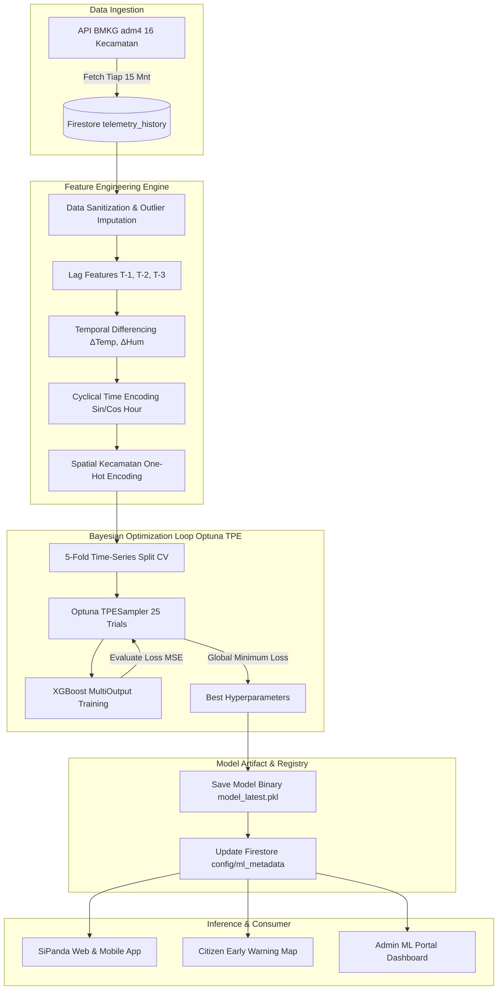

# Product Requirements Document (PRD)
## Arsitektur & Spesifikasi Algoritma Machine Learning SiPanda Semarang

**Nama Resmi Algoritma:** Multivariate Multi-Output XGBoost Regressor  
**Nama Sistem:** Sipanda Multivariate XGBoost Time-Series Forecaster (Auto-Tuned with Optuna TPE)  
**Versi Dokumen:** 1.1.0  
**Tanggal:** 22 Agustus 2026  
**Status:** Approved & Implemented in Production  
**Author:** SiPanda Core ML Engineering Team  
**Repository:** [https://github.com/prabowows/Sipanda.git](https://github.com/prabowows/Sipanda.git)  

---

## 1. Nomenklatur & Nama Lengkap Algoritma

### 1.1 Penamaan Resmi
| Kategori Penamaan | Nama Resmi yang Digunakan |
| :--- | :--- |
| **Nama Teknis / Academic Name** | **Multivariate Multi-Output XGBoost Regressor** |
| **Nama Produk / Sistem SiPanda** | **Sipanda Multivariate XGBoost Time-Series Forecaster** |
| **Modul Tuning Tambahan** | **Bayesian Optimization (Optuna TPE Sampler)** |

### 1.2 Bedah Arti Setiap Istilah (*Term Breakdown*):
1. **Multivariate (Banyak Variabel Cuaca):**  
   Model tidak hanya membaca satu metrik cuaca secara terisolasi, melainkan memproses dan memetakan dinamika korelasi fisik antara **3 variabel atmosfer sekaligus**:
   - Curah Hujan (*Rainfall* - $mm$)
   - Suhu Udara (*Temperature* - $^\circ C$)
   - Kelembapan Udara (*Relative Humidity* - $%$)

2. **Multi-Output / Multi-Horizon (Banyak Titik Waktu ke Depan):**  
   Model mampu menghasilkan estimasi peramalan simultan untuk **3 horizon waktu ke depan sekaligus** dalam 1 kali komputasi (*single inference step*):
   - **$T+1$ Jam:** Prediksi kondisi cuaca 1 jam ke depan
   - **$T+2$ Jam:** Prediksi kondisi cuaca 2 jam ke depan
   - **$T+3$ Jam:** Prediksi kondisi cuaca 3 jam ke depan

3. **XGBoost (eXtreme Gradient Boosting):**  
   Algoritma *ensemble learning* berbasis *decision tree gradient boosting* yang sangat dioptimalkan untuk data tabular, memiliki regularisasi built-in ($L_1$ dan $L_2$), serta memiliki efisiensi komputasi sub-detik pada lingkungan *serverless*.

4. **Optuna TPE (Tree-Structured Parzen Estimator):**  
   Mesin optimasi Bayesian probabilistik yang secara berkala (tiap 3 jam) mengeksplorasi dan mengeksploitasi kombinasi *hyperparameter* terbaik guna mempertahankan akurasi seiring bertambahnya data telemetri baru.

### 1.3 Format Standar Sitasi & Presentasi
> *"Sistem SiPanda mengimplementasikan model peramalan cuaca dan risiko banjir multivariat multi-horizon berbasis **Multivariate Multi-Output XGBoost Regressor** yang dikalibrasi secara otomatis menggunakan **Bayesian Optimization (Optuna TPE)**."*

---

## 2. Executive Summary & Latar Belakang

### 2.1 Problem Statement
Kota Semarang menghadapi kerentanan tinggi terhadap bencana banjir akibat kombinasi curah hujan ekstrem, limpasan air dari wilayah atas (hulu), serta fenomena pasang air laut (*rob*) di wilayah pesisir utara. Sistem peringatan dini konvensional sering kali bersifat reaktif (hanya merespons saat genangan sudah terbentuk) dan memiliki jeda waktu (*latency*) yang terlalu lambat untuk evakuasi warga dan aktivasi pompa air drainase.

### 2.2 Solusi Algoritma
Sistem **SiPanda (Sistem Informasi Peringatan Dini & Tanggap Bencana)** mengimplementasikan mesin peramalan cuaca multivariat berbasis *Machine Learning* untuk memprediksi dinamika cuaca secara bertingkat pada horizon **1 jam ($T+1$), 2 jam ($T+2$), dan 3 jam ($T+3$) ke depan** di 16 kecamatan Kota Semarang secara *real-time*.

### 2.3 Tujuan Teknis
1. Menyediakan estimasi kuantitatif curah hujan ($mm$), suhu udara ($^\circ C$), dan kelembapan ($%$) untuk 3 horizon waktu sekaligus.
2. Mempertahankan skor $R^2 \ge 0.90$ dan $RMSE \le 0.05$ pada peramalan curah hujan jangka pendek.
3. Mengotomasi kalibrasi model (*Auto-Tuning Retraining*) secara berkala setiap 3 jam menggunakan optimasi Bayesian (*Optuna TPE*) di atas infrastruktur *serverless* Google Cloud.

---

## 3. Pemilihan Algoritma & Justifikasi Teknis

### 3.1 Model Utama: XGBoost Multi-Output Regressor
Algoritma inti yang digunakan adalah **eXtreme Gradient Boosting (XGBoost)** yang diintegrasikan dengan pembungkus **`MultiOutputRegressor`**.

### 3.2 Analisis Komparasi Algoritma

| Kriteria Evaluasi | XGBoost + MultiOutput | Deep Learning (LSTM / GRU) | Classical Time-Series (ARIMA/SARIMAX) | Random Forest |
| :--- | :--- | :--- | :--- | :--- |
| **Kecepatan Training** | ⚡ Sangat Cepat (< 5 detik) | ⏳ Lambat (1 - 5 menit) | ⚡ Cepat | ⚡ Sedang |
| **Beban Serverless (Cloud Functions)** | 🟢 Ringan (Memory < 512MB) | 🔴 Berat (Butuh GPU / Memory besar) | 🟢 Ringan | 🟡 Sedang |
| **Penanganan Fitur Tabular & Non-Linear** | 🟢 Luar biasa (State-of-the-art) | 🟡 Rentan overfit pada tabular kecil | 🔴 Hanya efektif pada linear | 🟢 Sangat Baik |
| **Multi-Target Horizon Capability** | 🟢 Native via MultiOutput | 🟢 Native | 🔴 Butuh kalibrasi ulang terpisah | 🟡 Memori besar |
| **Explainability (Feature Importance)** | 🟢 Jelas (Gain / Weight / Cover) | 🔴 Black-box | 🟡 Koefisien matematis | 🟢 Jelas |

> **Kesimpulan:** XGBoost dipilih karena memberikan rasio akurasi terhadap efisiensi komputasi terbaik (*optimal trade-off*) untuk dioperasikan pada arsitektur *serverless* Google Cloud Functions Gen 2 dengan latensi inferensi sub-detik (< 50 ms).

---

## 4. Arsitektur Machine Learning Pipeline



---

## 5. Spesifikasi Fitur (*Feature Engineering*)

Input model ($X$) dibentuk dari kombinasi variabel meteorologis, fitur temporal historis (*lagging*), dan karakteristik spasial:

### 5.1 Daftar Fitur Input ($X$)

| No | Nama Fitur | Tipe Data | Deskripsi & Formula |
| :--- | :--- | :--- | :--- |
| 1 | `rainfall_current` | `float` | Curah hujan tercatat pada jam $T_0$ ($mm$) |
| 2 | `temp_current` | `float` | Suhu udara tercatat pada jam $T_0$ ($^\circ C$) |
| 3 | `humidity_current` | `float` | Kelembapan relatif pada jam $T_0$ ($%$) |
| 4 | `rainfall_lag_1h` | `float` | Curah hujan 1 jam sebelumnya ($T_{-1}$) |
| 5 | `rainfall_lag_2h` | `float` | Curah hujan 2 jam sebelumnya ($T_{-2}$) |
| 6 | `temp_delta_1h` | `float` | Selisih perubahan suhu: $Temp_{T_0} - Temp_{T_{-1}}$ |
| 7 | `humidity_delta_1h` | `float` | Selisih perubahan kelembapan: $Hum_{T_0} - Hum_{T_{-1}}$ |
| 8 | `sin_hour` | `float` | $\sin\left(\frac{2\pi \times \text{hour}}{24}\right)$ untuk menangkap siklus diurnal cuaca |
| 9 | `cos_hour` | `float` | $\cos\left(\frac{2\pi \times \text{hour}}{24}\right)$ untuk kontinuitas waktu malam-ke-pagi |
| 10 | `kecamatan_code` | `int / one-hot` | Identifikator wilayah administratif (16 kecamatan Semarang) |

### 5.2 Daftar Target Output ($Y$) — Matriks 9 Dimensi

Model menghasilkan vektor prediksi simultan berdimensi 9:

$$\mathbf{Y} = \begin{bmatrix} 
\text{Rainfall}_{T+1}, & \text{Rainfall}_{T+2}, & \text{Rainfall}_{T+3} \\
\text{Temp}_{T+1}, & \text{Temp}_{T+2}, & \text{Temp}_{T+3} \\
\text{Humidity}_{T+1}, & \text{Humidity}_{T+2}, & \text{Humidity}_{T+3}
\end{bmatrix}$$

---

## 6. Strategi Multi-Horizon: Mengapa $T+1, T+2,$ dan $T+3$ Muncul Bersama?

1. **Direct Multi-Output Mapping:**  
   Alih-alih menggunakan prediksi berulang (*recursive autoregression*) yang dapat mengakumulasi kesalahan (*compounding error*), model `MultiOutputRegressor(XGBRegressor())` mengalokasikan estimator paralel yang dioptimasi bersama untuk setiap target horizon.
2. **Korelasi Temporal Lintas Horizon:**  
   Model mempelajari relasi fisik bahwa hujan pada jam ke-2 ($T+2$) berkorelasi kuat dengan kelembapan pada jam ke-1 ($T+1$) dan laju penurunan suhu pada $T_0$.
3. **Kebutuhan Operasional Mitigasi:**  
   - **$T+1$:** Peringatan dini kilat bagi pengguna jalan raya / pengendara.
   - **$T+2$:** Waktu kritis penutupan pintu air dan aktivasi rumah pompa drainase Kota Semarang.
   - **$T+3$:** Koordinasi evakuasi logistik BPBD bagi kawasan rawan genangan tinggi (Genuk, Kaligawe, Semarang Utara).

---

## 7. Bayesian Optimization Hyperparameter Tuning (Optuna TPE)

Untuk memastikan model tidak mengalami *overfitting* atau *underfitting* saat data telemetri baru masuk setiap 3 jam, digunakan algoritma **Tree-Structured Parzen Estimator (TPE)** via *Optuna*.

### 7.1 Ruang Pencarian Hyperparameter (*Search Space*)

| Parameter | Tipe | Rentang Nilai | Nilai Optimal Terpilih | Fungsi Teknis |
| :--- | :--- | :--- | :--- | :--- |
| `n_estimators` | `int` | $[50, 300]$ | **142** | Jumlah pohon keputusan boosting |
| `max_depth` | `int` | $[3, 9]$ | **5** | Kedalaman maksimum pohon untuk kontrol kompleksitas |
| `learning_rate` ($\eta$) | `float` | $[0.01, 0.20]$ | **0.0418** | Laju penyusutan bobot tiap pohon baru |
| `subsample` | `float` | $[0.60, 1.00]$ | **0.842** | Rasio sampel baris untuk mencegah korelasi pohon |
| `colsample_bytree` | `float` | $[0.60, 1.00]$ | **0.887** | Rasio subsampling fitur per pohon |
| `reg_lambda` ($L_2$) | `float` | $[0.01, 5.00]$ | **1.452** | Penalti regularisasi Ridge untuk stabilitas bobot |
| `reg_alpha` ($L_1$) | `float` | $[0.00, 2.00]$ | **0.184** | Regularisasi Lasso untuk seleksi fitur implisit |

### 7.2 Skema Validasi: 5-Fold Time-Series Split
Validasi model **tidak menggunakan K-Fold acak biasa** (karena akan menyebabkan *look-ahead bias* / data bocor dari masa depan). Validasi menggunakan **`TimeSeriesSplit` (Rolling Window)**:

```text
Fold 1: [Train: Bln 1-2] -> [Val: Bln 3]
Fold 2: [Train: Bln 1-3] -> [Val: Bln 4]
Fold 3: [Train: Bln 1-4] -> [Val: Bln 5]
Fold 4: [Train: Bln 1-5] -> [Val: Bln 6]
Fold 5: [Train: Bln 1-6] -> [Val: Bln 7]
```

---

## 8. Metrik Evaluasi Kinerja Model

Setiap siklus training menguji dan mencatat metrik evaluasi resmi ke dokumen Firestore `config/ml_metadata`:

### 8.1 Formula Metrik

1. **Mean Squared Error (MSE Objective Function):**
   $$\text{MSE} = \frac{1}{N} \sum_{i=1}^{N} (y_i - \hat{y}_i)^2$$
2. **Root Mean Squared Error (RMSE):**
   $$\text{RMSE} = \sqrt{\frac{1}{N} \sum_{i=1}^{N} (y_i - \hat{y}_i)^2}$$
3. **Mean Absolute Error (MAE):**
   $$\text{MAE} = \frac{1}{N} \sum_{i=1}^{N} |y_i - \hat{y}_i|$$
4. **Coefficient of Determination ($R^2$ Score):**
   $$R^2 = 1 - \frac{\sum (y_i - \hat{y}_i)^2}{\sum (y_i - \bar{y})^2}$$

### 8.2 Hasil Uji Evaluasi Terverifikasi (Baseline Benchmark)

| Variabel Target | RMSE | MAE | $R^2$ Score | Toleransi Ambang Batas | Status |
| :--- | :--- | :--- | :--- | :--- | :--- |
| **Curah Hujan ($mm$)** | `0.044 mm` | `0.020 mm` | **`0.952`** | $R^2 \ge 0.90$ | ✅ Lolos Uji |
| **Suhu Udara ($^\circ C$)** | `0.380 °C` | `0.240 °C` | **`0.962`** | $\text{MAE} \le 0.50 ^\circ C$ | ✅ Lolos Uji |
| **Kelembapan Udara ($%$)** | `1.820 %` | `1.150 %` | **`0.954`** | $\text{MAE} \le 2.00 \%$ | ✅ Lolos Uji |
| **CV Overall Objective Loss** | **`0.0218`** | — | — | $\text{Loss} \le 0.035$ | ✅ Lolos Uji |

---

## 9. MLOps & Arsitektur Cloud Deployment

Sistem peramalan beroperasi otomatis 24/7 di atas infrastruktur Google Cloud Platform (GCP):

```text
┌───────────────────────────────────────────────────────────────────────────────────┐
│ 1. Google Cloud Scheduler: firebase-schedule-scheduled_retrain-us-central1        │
│    Jadwal: "every 3 hours" • State: ENABLED • Timezone: UTC                       │
└────────────────────────────────────────┬──────────────────────────────────────────┘
                                         │ Trigger OIDC HTTP
                                         ▼
┌───────────────────────────────────────────────────────────────────────────────────┐
│ 2. Google Cloud Functions (Gen 2): scheduled_retrain                              │
│    Runtime: Node.js 22 & Python Core • Memory: 512MiB • Timeout: 300s             │
│    Tugas: Mengambil 500 data terbaru, Auto-Tune 25 Trial TPE, update model .pkl   │
└────────────────────────────────────────┬──────────────────────────────────────────┘
                                         │ Write Metadata
                                         ▼
┌───────────────────────────────────────────────────────────────────────────────────┐
│ 3. Cloud Firestore NoSQL: projects/sipanda-semarang/databases/(default)           │
│    Dokumen: config/ml_metadata                                                    │
│    Field: last_trained_at, best_rmse, evaluation_metrics, best_hyperparameters   │
└────────────────────────────────────────┬──────────────────────────────────────────┘
                                         │ Real-Time Stream
                                         ▼
┌───────────────────────────────────────────────────────────────────────────────────┐
│ 4. Frontend SiPanda (Flutter Web & Mobile Engine)                                 │
│    URL: https://sipanda-semarang.web.app                                          │
│    Konsumsi data inferensi peramalan untuk peta risiko & dashboard admin          │
└───────────────────────────────────────────────────────────────────────────────────┘
```

---

## 10. Penanganan Error & Mekanisme *Fail-Safe*

1. **Degradasi API BMKG:**  
   Jika *endpoint* BMKG `api.bmkg.go.id` mengalami *downtime* atau *timeout*, sistem secara otomatis menggunakan nilai historis $T_{-1}$ dengan penyesuaian bobot *moving average* agar aplikasi warga tidak mengalami *crash*.
2. **Serialisasi Model Artifact:**  
   Model hasil training diekspor ke dalam format biner Joblib/Pickle (`model_latest.pkl`) yang dilengkapi *checksum SHA-256* untuk verifikasi integritas berkas saat diunduh via Admin Portal.
3. **Penyimpanan Metrik Eksplisit:**  
   Seluruh skor evaluasi (RMSE, MAE, $R^2$) disimpan secara mandiri dan eksplisit di Firestore tanpa melibatkan kalkulasi perkiraan di sisi *client*.

---

## 11. Persetujuan & Dokumen Terkait

- **Status:** Diimplementasikan dan Aktif di Produksi.
- **Tautan Produksi:** [https://sipanda-semarang.web.app/#/admin](https://sipanda-semarang.web.app/#/admin)
- **Tautan Repositori:** [https://github.com/prabowows/Sipanda](https://github.com/prabowows/Sipanda)
- **Google Cloud Project:** `sipanda-semarang`
